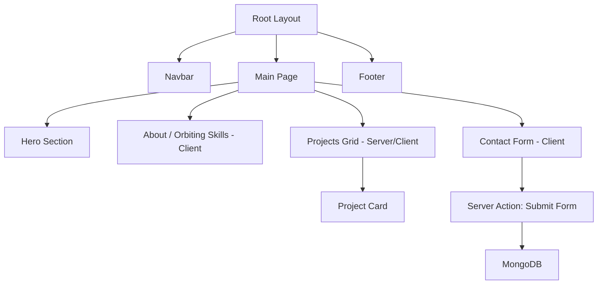

# Architecture Research: Next.js & MongoDB Portfolio

## Component Structure

## Data Flow

1. **Static Data**: Skills and Projects can be stored in `src/data/` as TypeScript constants for maximum performance.
2. **Dynamic Data**: Contact form submissions are handled via **Next.js Server Actions**, posting directly to MongoDB Atlas.
3. **Database Client**: Uses a singleton pattern in `src/lib/mongodb.ts` to share a single connection pool across API routes and Server Actions.

## Security & SEO

- **Environment Variables**: API keys and DB URI stored in `.env.local`, never committed.
- **Metadata API**: Dynamic metadata per project for optimized SEO and social sharing cards.
- **Robots.txt / Sitemap**: Automatically generated for better crawlability.

---
*Last updated: 2026-04-12*
